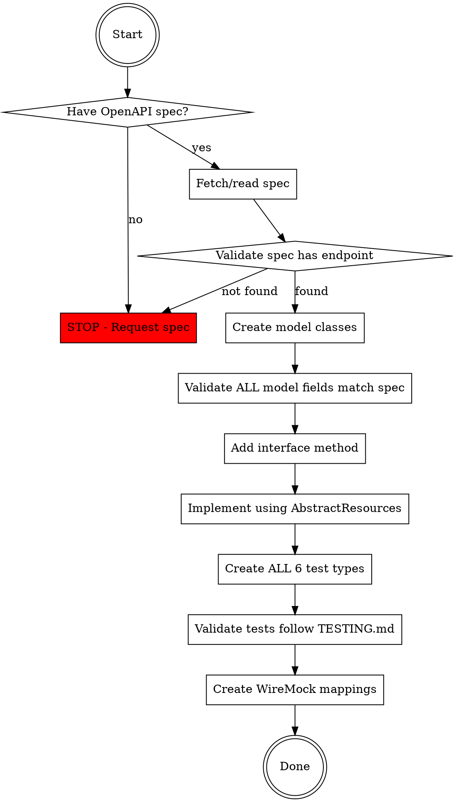

# Implementing API Endpoints in Smartsheet Java SDK

## Overview

This skill ensures API endpoint implementations follow SDK architecture patterns, validate against OpenAPI specifications, and include complete test coverage per TESTING.md rules.

**Core principle:** Every endpoint must match the OpenAPI spec exactly and have all 6 mandatory test types.

## When to Use

Use when:
- Adding a new API endpoint to the SDK
- Modifying an existing endpoint
- Before writing any implementation code or tests
- User mentions "implement endpoint" or provides OpenAPI spec

Do NOT use for:
- Bug fixes in existing endpoints (unless changing API contract)
- Internal refactoring without API changes
- Documentation-only updates

## Prerequisites

**You MUST have the OpenAPI specification before starting.**

Two options:
1. **Public API endpoints**: Use Smartsheet's public spec at https://developers.smartsheet.com/_spec/api/smartsheet/openapi.json
2. **New/unreleased endpoints**: User MUST provide the OpenAPI spec file path or content

**If no spec is available, STOP. Do not implement without specification.**

## Implementation Workflow



## Step 1: OpenAPI Spec Validation

**MANDATORY: Verify spec before any code.**

For public endpoints:
```bash
# Fetch the spec
curl -s https://developers.smartsheet.com/_spec/api/smartsheet/openapi.json > openapi.json

# Verify endpoint exists (example: GET /users/{userId}/plans)
jq '.paths."/users/{userId}/plans".get' openapi.json
```

For user-provided specs:
- Read the spec file they provide
- Validate it's valid OpenAPI/Swagger format
- Confirm endpoint definition is complete

**Checklist:**
- [ ] Endpoint path and method defined
- [ ] Request parameters documented (path, query, body)
- [ ] Response schema defined with all properties
- [ ] Required vs optional fields marked
- [ ] Property types specified (integer, string, array, etc.)
- [ ] Nested object schemas defined

## Step 2: Create Model Classes

Reference: `ADVANCED.md` → Model Object Construction section

**For EACH model in the response:**

1. Create POJO in `src/main/java/com/smartsheet/api/models/`
2. Follow JavaBean conventions: private fields, public getters/setters
3. **Validate EVERY field against OpenAPI schema:**
   - Field name matches spec property name (camelCase)
   - Java type matches spec type (Long for int64, String for string, List for array, etc.)
   - Required fields vs optional fields documented
   - Nested objects have their own model classes

**Example validation (UserPlan model):**

OpenAPI spec shows:
```yaml
UserPlan:
  required: [planId, seatType]
  properties:
    planId:
      type: integer
      format: int64
    seatType:
      type: string
    seatTypeLastChangedAt:
      type: string
      format: date-time
```

Java model MUST have:
```java
private Long planId;              // int64 → Long (required)
private SeatType seatType;        // string enum → SeatType (required)
private ZonedDateTime seatTypeLastChangedAt;  // date-time → ZonedDateTime (optional)
```

## Step 3: Add Interface Method

Reference: `ADVANCED.md` → Resource Module Organization section

1. Add method to appropriate `*Resources` interface (e.g., `UserResources.java`)
2. Include complete Javadoc with @param, @return, @throws
3. Declare proper exception types: `SmartsheetException`, `InvalidRequestException`, etc.
4. Follow naming convention: `list*()`, `get*()`, `create*()`, `update*()`, `delete*()`

## Step 4: Implement Using AbstractResources Pattern

Reference: `ADVANCED.md` → Request Lifecycle section

**REQUIRED: Use AbstractResources template methods.**

Common patterns:
- **GET single resource**: `getResource(path, ResponseClass.class)`
- **GET collection**: `listResources(path, ResponseClass.class)` or `listResourcesWithWrapper()`
- **POST create**: `createResource(path, ResponseClass.class, requestObject)`
- **PUT update**: `updateResource(path, ResponseClass.class, requestObject)`
- **DELETE**: `deleteResource(path, ResponseClass.class)`

**Example (GET with pagination):**
```java
public TokenPaginatedResult<UserPlan> listUserPlans(long userId, String lastKey, Long maxItems) {
    String path = USERS + "/" + userId + "/plans";
    Map<String, Object> parameters = new HashMap<>();
    if (lastKey != null) {
        parameters.put("lastKey", lastKey);
    }
    if (maxItems != null) {
        parameters.put("maxItems", maxItems);
    }
    return listResourcesWithTokenPagination(path, UserPlan.class, parameters);
}
```

**Do NOT:**
- Call HttpClient directly (bypasses retry logic, logging, error handling)
- Implement custom deserialization (Jackson handles it)
- Skip query parameter null checks (causes empty param keys)

## Step 5: Create ALL 6 Mandatory Test Types

Reference: `TESTING.md` → Mock API Test Patterns section

**ABSOLUTE REQUIREMENT: Every endpoint MUST have all 6 tests.**

Create test class in `src/test/java/com/smartsheet/api/sdktest/{resource}/Test{Operation}.java`

### Test 1: testXxxGeneratedUrlIsCorrect
- Validates URL path construction
- Validates query parameters as complete objects (NOT one-by-one)
- Validates HTTP method

### Test 2: testXxxAllResponseBodyProperties
- Validates response with ALL optional fields included
- Requires instanceof check for response type
- Asserts EVERY property from OpenAPI spec
- For nested objects: assert all nested properties

### Test 3: testXxxRequiredResponseBodyProperties
- Validates response with ONLY required fields
- Tests SDK handles sparse API responses
- Create this test ONLY if WireMock mapping exists

### Test 4: testXxxError400Response
- Validates 4xx client error handling
- Uses shared `/errors/400-response` mapping
- Asserts correct exception type and message

### Test 5: testXxxError500Response
- Validates 5xx server error handling
- Uses shared `/errors/500-response` mapping
- Asserts correct exception type and message

### Test 6: Additional Behavioral Tests
- Null parameter handling
- Edge cases specific to endpoint
- Special character encoding
- Pagination behavior (if applicable)

## Step 6: Validate Test Quality

**Checklist from TESTING.md:**

- [ ] **instanceof checks**: Every response object has type validation
- [ ] **Whole-object assertions**: All properties validated, not just spot checks
- [ ] **Query parameter validation**: Complete objects, not existence checks
- [ ] **Request body validation** (for POST/PUT): JSON tree comparison with ObjectMapper
- [ ] **No property-by-property skipping**: If spec has 15 fields, assert all 15
- [ ] **For Result-wrapped responses**: Both wrapper and inner result instanceof checks

## Step 7: Create WireMock Mappings

Reference: `TESTING.md` → WireMock Mapping Creation section

**Tests will fail without mappings.**

Create mapping files in smartsheet-sdk-tests repository:
- One for `all-response-body-properties` (includes all optional fields)
- One for `required-response-body-properties` (only required fields)
- Error mappings usually exist already (`/errors/400-response`, `/errors/500-response`)

Mapping x-test-name MUST match test code:
```java
// Test code
Utils.createWiremockSmartsheetClient("/users/list-user-plans/all-response-body-properties", requestId);

// Mapping file: users-list-user-plans-all-properties.json
"x-test-name": {
  "equalTo": "/users/list-user-plans/all-response-body-properties"
}
```

## Red Flags - STOP and Review

These thoughts mean you're cutting corners:

- "6 tests is too many for this simple endpoint"
- "The spec is incomplete, I'll implement what I know"
- "Required/all property tests are redundant"
- "I'll add more tests if QA finds issues"
- "We've already spent X hours, need to wrap up"
- "Just spot-check key fields, full validation is tedious"
- "I can call HttpClient directly for this simple GET"
- "Tests are optional under time pressure"

**All of these mean: STOP. Follow the process completely.**

## Common Rationalizations

| Excuse | Reality |
|--------|---------|
| "6 tests is too many" | Each test type catches different issues. All 6 are required. |
| "Required/all property tests are redundant" | Required tests validate minimal API contract. All tests catch field additions. Both needed. |
| "We'll add tests later" | Tests written after catch zero design issues. Later never comes. |
| "We have SOME coverage" | Partial coverage gives false confidence. Regressions slip through gaps. |
| "We've spent 3 hours already" | Sunk cost fallacy. Skipping tests costs more time debugging production issues. |
| "Spec is incomplete, I'll guess" | Wrong guesses break API contract. Get complete spec or STOP. |
| "Full field validation is tedious" | One missed field = production bug. Validate every field. |
| "HttpClient directly is simpler" | Bypasses retry, logging, error handling. Always use AbstractResources. |

## Common Mistakes

### Mistake 1: Skipping Spec Validation
**Problem:** Implementing based on assumptions or partial documentation.

**Fix:** Always fetch complete OpenAPI spec. Validate every field, type, and requirement before coding.

### Mistake 2: Incomplete Test Coverage
**Problem:** Creating 3 tests instead of 6 because "it's enough."

**Fix:** All 6 test types are mandatory. Each catches different categories of bugs. No exceptions.

### Mistake 3: Spot-Checking Fields
**Problem:** Validating only id/name/permalink, skipping other fields.

**Fix:** Assert EVERY field from OpenAPI spec. Use complete object assertions, not sampling.

### Mistake 4: Bypassing AbstractResources
**Problem:** Calling HttpClient directly for "simple" requests.

**Fix:** Always use AbstractResources template methods. They provide retry logic, logging, error handling.

## Real-World Impact

**Without this process:**
- Production bugs from missed optional fields
- Silent failures when API adds new fields
- Inconsistent error handling across endpoints
- Missing retry logic causes transient failures
- Incomplete test coverage gives false confidence

**Following this process:**
- API contract violations caught immediately
- Complete test coverage prevents regressions
- Consistent architecture across all endpoints
- Proper retry/logging/error handling for free
- Self-documenting code with OpenAPI validation
