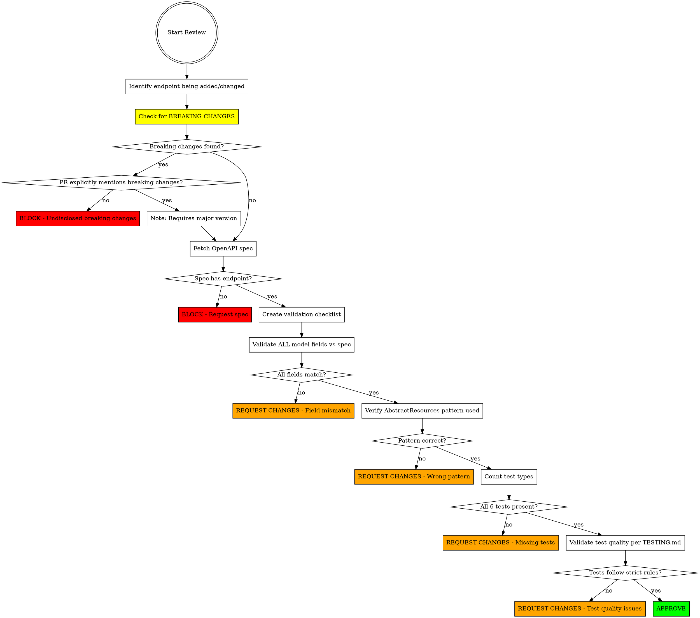

# Reviewing API Endpoint Implementations in Smartsheet Java SDK

## Overview

This skill ensures API endpoint reviews validate against OpenAPI specifications, verify complete test coverage per TESTING.md, and enforce SDK architecture patterns from ADVANCED.md.

**Core principle:** Cannot approve without validating every field against OpenAPI spec, verifying all 6 mandatory tests exist, and detecting breaking changes.

**CRITICAL:** Breaking changes detection is the HIGHEST PRIORITY review concern. Even perfect implementation must be blocked if it contains undisclosed breaking changes.

## When to Use

Use when:
- Reviewing PR that adds new API endpoint
- Reviewing PR that modifies existing endpoint
- Reviewing model class changes for API responses
- Before approving any endpoint-related code

Do NOT use for:
- Non-API code reviews (utilities, internal helpers)
- Documentation-only changes
- Test-only fixes (unless they affect API contract)

## Review Workflow



## Step 0: Check for Breaking Changes (CRITICAL - DO THIS FIRST)

**⚠️ INCREDIBLY IMPORTANT: Breaking changes detection is the HIGHEST PRIORITY concern in API reviews.**

**This check happens BEFORE all other validation. Even perfect code must be BLOCKED if it contains undisclosed breaking changes.**

### Why This Matters

Breaking changes in a public SDK:
- Break every user's code that depends on changed APIs
- Require major version bump (semantic versioning)
- Require migration guides and announcements
- Can block users from upgrading (stuck on old versions)
- Damage trust if shipped without warning

**Rule:** Unless PR description EXPLICITLY mentions "breaking change" or "breaking changes", ANY detected breaking change MUST result in BLOCKED approval.

### Breaking Changes Checklist

Compare git diff of public interfaces, classes, and methods. Check for:

#### Method Signature Changes (ALWAYS BREAKING)
- [ ] Method renamed (even with better name)
- [ ] Method removed (even if deprecated)
- [ ] Parameters added/removed/reordered
- [ ] Parameter types changed
- [ ] Return type changed
- [ ] Exception types in throws clause changed
- [ ] Method moved to different class/interface

#### Field Changes in Public Models (ALWAYS BREAKING)
- [ ] Public field removed
- [ ] Public field renamed
- [ ] Public getter/setter removed or renamed
- [ ] Field type changed
- [ ] Field nullability changed (required ↔ optional)

#### Access Modifier Changes (USUALLY BREAKING)
- [ ] public → protected/private (removes access)
- [ ] Interface method added (forces implementation)
- [ ] Abstract method added to base class

#### Class/Interface Changes (ALWAYS BREAKING)
- [ ] Class/interface removed
- [ ] Class/interface renamed
- [ ] Class moved to different package
- [ ] Interface added to implements clause (forces contract)
- [ ] Inheritance hierarchy changed

#### Exception Behavior Changes (SUBTLE BUT BREAKING)
- [ ] Method throws new exception types
- [ ] Method no longer throws documented exception
- [ ] Exception hierarchy changed

### How to Check

**For each modified file in PR:**

```bash
# Get list of modified public files
git diff --name-only origin/mainline...HEAD | grep -E '(Resources\.java|models/.*\.java)'

# For each file, check what changed
git diff origin/mainline...HEAD path/to/File.java
```

**Look for:**
1. **Method signatures**: Any change to public method name, parameters, return type
2. **Field declarations**: Any change to getter/setter names or return types
3. **Class declarations**: Changes to class name, implements, extends
4. **Access modifiers**: Changes from public to less accessible

### Breaking Changes Detection Examples

**Example 1: Method Rename**
```java
// OLD (mainline)
public TokenPaginatedResult<UserPlan> listUserPlans(long userId, String lastKey, Long maxItems)

// NEW (PR)
public TokenPaginatedResult<UserPlan> getUserPlans(long userId, String lastKey, Long maxItems)
```
**BREAKING:** Method name changed. All user code calling `listUserPlans()` breaks.

**Example 2: Field Removal**
```java
// OLD
private Boolean isInternal;
public Boolean getIsInternal() { return isInternal; }

// NEW
// (field removed, getter removed)
```
**BREAKING:** Public getter removed. All user code calling `getIsInternal()` breaks.

**Example 3: Return Type Change**
```java
// OLD
public List<Sheet> listSheets()

// NEW
public PagedResult<Sheet> listSheets()
```
**BREAKING:** Return type changed. User code assigning to `List<Sheet>` breaks.

**Example 4: Parameter Addition (SEEMS safe, ACTUALLY breaking)**
```java
// OLD
public Report createReport(ReportDefinition definition)

// NEW
public Report createReport(ReportDefinition definition, Boolean validate)
```
**BREAKING:** New required parameter. All existing calls missing the parameter break.

### PR Description Validation

**After detecting breaking changes:**

1. Read PR description/commit messages
2. Search for keywords: "breaking", "breaking change", "major version", "backwards incompatible"
3. Check if author explicitly acknowledges the breaking change

**If breaking changes found AND not mentioned:**
```
🚫 BLOCK APPROVAL

CRITICAL: This PR contains BREAKING CHANGES that are not disclosed in the PR description.

Breaking changes detected:
- [List each breaking change with file:line reference]

**This PR CANNOT be approved** unless:
1. PR description explicitly mentions "breaking change" or "breaking changes"
2. Justification provided for why breaking change is necessary
3. Planned for major version release (e.g., 4.0.0)
4. Migration path documented

Semantic versioning requires major version bump for ANY breaking change.
```

**If breaking changes found AND mentioned:**
```
⚠️ WARNING: Breaking Changes Detected

This PR contains breaking changes (acknowledged by author):
- [List each breaking change]

Before approval, verify:
- [ ] Planned for major version release (X.0.0)
- [ ] CHANGELOG updated with breaking change notice
- [ ] Migration guide created/updated
- [ ] Sufficient justification provided

Proceed with review of other aspects.
```

### Common Rationalizations to REJECT

| Excuse | Reality |
|--------|---------|
| "It's an improvement" | Improvements can be breaking. If it changes API surface, it's breaking. |
| "API changed, SDK should match" | SDK breaking changes are independent of API changes. Still breaking. |
| "It's technically compatible" | Behavior changes break user expectations. Still breaking. |
| "We deprecated it already" | Deprecation warns about future removal. Removal itself is breaking. |
| "Better name" / "More intuitive" | Renaming is breaking. No matter how much better. |
| "Only affects edge cases" | Any code breakage is breaking, regardless of how few users affected. |
| "Tests pass" | Tests don't represent all user code in the wild. |
| "We'll document it" | Documentation doesn't make breaking changes non-breaking. |

### When Breaking Changes Are Acceptable

Breaking changes ARE acceptable when:
1. **Explicitly disclosed** in PR description
2. **Justified** - clear reason why breaking change is necessary
3. **Planned** for major version release (X.0.0)
4. **Documented** - migration guide, CHANGELOG entry
5. **Approved** by maintainers for inclusion in next major release

But still must be FLAGGED in review as requiring major version.

## Step 1: Fetch OpenAPI Specification

**MANDATORY: Cannot review without spec.**

For public endpoints:
```bash
# Fetch Smartsheet public API spec
curl -s https://developers.smartsheet.com/_spec/api/smartsheet/openapi.json > /tmp/openapi.json

# Find the endpoint (example: GET /users/{userId}/plans)
jq '.paths."/users/{userId}/plans".get' /tmp/openapi.json
```

For unreleased endpoints:
- Request OpenAPI spec from PR author
- If no spec exists: **BLOCK the PR** - implementation without spec is not reviewable

**If spec is unavailable: STOP. Request spec before continuing review.**

## Step 2: Create Model Field Validation Checklist

For each model class in the PR, extract all properties from OpenAPI spec and create a validation checklist.

**Example: Validating UserPlan model**

OpenAPI spec shows:
```yaml
UserPlan:
  required: [planId, seatType]
  properties:
    planId:
      type: integer
      format: int64
    seatType:
      type: string
      enum: [MEMBER, VIEWER, EDITOR, ADMIN, CONTRIBUTOR]
    seatTypeLastChangedAt:
      type: string
      format: date-time
    provisionalExpirationDate:
      type: string
      format: date-time
    isInternal:
      type: boolean
```

Validation checklist:
- [ ] `planId` field exists as `Long` (int64 → Long)
- [ ] `planId` is documented as required
- [ ] `seatType` field exists as `SeatType` enum
- [ ] `seatType` is documented as required
- [ ] `SeatType` enum has all values from spec
- [ ] `seatTypeLastChangedAt` field exists as `ZonedDateTime`
- [ ] `seatTypeLastChangedAt` is optional (no required marking)
- [ ] `provisionalExpirationDate` field exists as `ZonedDateTime`
- [ ] `provisionalExpirationDate` is optional
- [ ] `isInternal` field exists as `Boolean`
- [ ] `isInternal` is optional
- [ ] NO extra fields exist in model not in spec

## Step 3: Validate ALL Model Fields vs Spec

**CRITICAL: Must validate EVERY field, not spot-check.**

For each field in checklist:

### Field Exists Check
```bash
# Verify field exists in model class
grep -n "private Long planId" UserPlan.java
grep -n "private SeatType seatType" UserPlan.java
```

### Type Mapping Check

OpenAPI type → Java type mapping:
| OpenAPI Type | Format | Java Type |
|--------------|--------|-----------|
| integer | int32 | Integer |
| integer | int64 | Long |
| string | - | String |
| string | date-time | ZonedDateTime |
| string | date | LocalDate |
| boolean | - | Boolean |
| number | float | Float |
| number | double | Double |
| array | - | List<T> |
| object | - | Custom class |

### Required vs Optional Check
- **Required fields**: Documented in Javadoc or ADVANCED.md
- **Optional fields**: Can be null, no validation errors

### Nested Objects Check
If property is object type, recursively validate nested model:
- Nested model class exists
- All nested properties validated against spec
- Proper composition via typed fields

### Enum Validation
If property is enum:
- Enum class exists with correct name
- All enum values from spec are present
- No extra enum values not in spec
- `toString()` method for serialization

## Step 4: Verify Implementation Patterns

Reference: `ADVANCED.md` → Request Lifecycle, Resource Module Organization sections

### Check 1: Uses AbstractResources Template Methods

**REQUIRED: Implementation MUST use AbstractResources, not HttpClient directly.**

Correct patterns:
```java
// GET single resource
return getResource(path, ResponseClass.class);

// GET collection with pagination
return listResourcesWithWrapper(path, ResponseClass.class, parameters);

// GET with token pagination
return listResourcesWithTokenPagination(path, ResponseClass.class, parameters);

// POST create
return createResource(path, ResponseClass.class, requestObject);

// PUT update
return updateResource(path, ResponseClass.class, requestObject);

// DELETE
return deleteResource(path, ResponseClass.class);
```

**Red flag:** Direct HttpClient usage bypasses retry logic, logging, error handling.

### Check 2: Query Parameter Handling

Verify optional query parameters:
```java
// ✅ GOOD: Null check before adding
if (lastKey != null) {
    parameters.put("lastKey", lastKey);
}

// ❌ BAD: Always adds (causes empty params)
parameters.put("lastKey", lastKey);
```

### Check 3: Proper Pagination Type

Match spec pagination type:
- **PagedResult**: Offset-based (has pageNumber, totalCount)
- **TokenPaginatedResult**: Cursor-based (has lastKey)
- **EventResult**: Stream-based (has nextStreamPosition)

Verify implementation uses correct `listResources*` method for pagination type.

## Step 5: Verify ALL 6 Mandatory Test Types Exist

Reference: `TESTING.md` → The 6 Mandatory Test Case Types section

**Count tests in test file. Must find exactly 6 (or more).**

Required tests:
1. ✅ `testXxxGeneratedUrlIsCorrect` - URL and query param validation
2. ✅ `testXxxAllResponseBodyProperties` - Full response with all optional fields
3. ✅ `testXxxRequiredResponseBodyProperties` - Minimal response (if WireMock mapping exists)
4. ✅ `testXxxError400Response` - 4xx client error handling
5. ✅ `testXxxError500Response` - 5xx server error handling
6. ✅ Additional behavioral test - Edge cases, null handling, etc.

**If any test is missing: REQUEST CHANGES with specific list of missing tests.**

### Common Rationalization to Reject

| Developer Says | Your Response |
|----------------|---------------|
| "Required/All tests are redundant" | "They test different failure modes: minimal API responses vs full responses. Both required." |
| "3 tests are good coverage" | "TESTING.md mandates 6 test types. 'Good' ≠ 'complete'. Request missing tests." |
| "400/500 tests are the same" | "4xx = client errors (not retried), 5xx = server errors (may retry). Different paths." |
| "Behavioral tests are nice-to-have" | "TESTING.md lists them as test type #6. Mandatory, not optional." |

## Step 6: Validate Test Quality

Reference: `TESTING.md` → Strict Assertion Rules section

For EACH test, verify:

### Rule 1: Whole-Object Assertions
```java
// ❌ BAD: Spot checking
assertThat(response.getId()).isEqualTo(123);
assertThat(response.getName()).isEqualTo("Test");
// (missing 10 other fields)

// ✅ GOOD: All fields validated
assertThat(response.getId()).isEqualTo(123);
assertThat(response.getName()).isEqualTo("Test");
assertThat(response.getDescription()).isEqualTo("...");
assertThat(response.getCategories()).hasSize(2);
// (all fields explicitly checked)
```

### Rule 2: Query Parameter Validation as Objects
```java
// ❌ BAD: Existence check only
assertThat(receivedQueryParams.containsKey("maxItems")).isTrue();

// ✅ GOOD: Complete object validation
assertThat(receivedQueryParams.get("maxItems").getValues()).isEqualTo(List.of("100"));
```

### Rule 3: Request Body Validation (POST/PUT)
```java
// ✅ Required for create/update endpoints
String requestBody = wiremockRequest.getBodyAsString();
ObjectMapper objectMapper = new ObjectMapper();
String expectedJson = objectMapper.writeValueAsString(EXPECTED_REQUEST_BODY);
assertThat(objectMapper.readTree(requestBody)).isEqualTo(objectMapper.readTree(expectedJson));
```

**If test quality issues found: REQUEST CHANGES with specific fixes needed.**

## Step 7: Verify WireMock Mappings Exist

Tests reference WireMock stub mappings. Verify they exist:

```bash
# Check if mapping file exists in smartsheet-sdk-tests repo
ls smartsheet-sdk-tests/mappings/*list-user-plans*
```

**If mappings missing: REQUEST CHANGES - tests will fail at runtime.**

## Decision: Approve or Request Changes

**ONLY approve if ALL checks pass:**
- [ ] **NO breaking changes OR breaking changes explicitly disclosed in PR** (CRITICAL - check first)
- [ ] OpenAPI spec validated for all model fields
- [ ] All field types match spec exactly
- [ ] Required vs optional marking correct
- [ ] AbstractResources pattern used correctly
- [ ] Query parameter handling correct
- [ ] Pagination type matches spec
- [ ] All 6 mandatory test types present
- [ ] Test quality follows TESTING.md strict rules
- [ ] WireMock mappings exist (or documented as needed)

**If ANY check fails: REQUEST CHANGES with specific actionable feedback.**

**If breaking changes detected without disclosure: BLOCK IMMEDIATELY - do not proceed with other checks.**

## Red Flags - Do NOT Accept These Arguments

Stop and reject when you hear:

**Breaking Changes (CRITICAL):**
- "It's an improvement, not a breaking change" - API improvements can break code. Still breaking.
- "API changed, so SDK should match" - SDK changes are independent breaking changes.
- "It's technically compatible" - Behavior changes break expectations. Still breaking.
- "We deprecated it" - Deprecation ≠ removal. Removal is breaking.
- "Better name" / "More intuitive" - Renaming is breaking. No matter how much better.
- "Only affects edge cases" - Any code breakage is breaking, regardless of frequency.

**Review Quality:**
- "Senior developer wrote it, trust them" - Experience ≠ infallible. Validate anyway.
- "Tests pass, so it's correct" - Tests can pass with wrong fields/types. Spec is truth.
- "We need to merge today" - Time pressure doesn't justify incorrect API contracts.
- "Field-by-field validation is tedious" - Tedious beats production bugs. Non-negotiable.
- "3 tests are good coverage" - TESTING.md requires 6. Not optional.
- "I'll add tests/fields later" - Later never comes. Complete now or reject.
- "Spot-check key fields is enough" - Partial validation misses bugs. Validate all.

**All of these mean: REQUEST CHANGES or BLOCK. Do not compromise.**

## Common Rationalizations

| Excuse | Reality |
|--------|---------|
| **Breaking Changes** | |
| "It's an improvement" | Improvements can be breaking. If API surface changes, it's breaking. |
| "API changed, SDK should match" | SDK breaking changes are independent. Still requires major version. |
| "Technically compatible" | Behavior changes break user expectations. Still breaking. |
| "We deprecated it already" | Deprecation warns. Removal itself is breaking. |
| "Better name/More intuitive" | Renaming is breaking. No matter how much better. |
| "Only edge cases affected" | Any code breakage is breaking, regardless of frequency. |
| "Tests pass" | Tests don't represent all user code. Breaking is breaking. |
| "We'll document it" | Documentation doesn't make breaking changes non-breaking. |
| **Review Quality** | |
| "Senior dev wrote it" | Authority doesn't prevent spec drift. Validate every field. |
| "Tests pass" (correctness) | Tests can pass with wrong types, missing fields. Spec is source of truth. |
| "Merge today" | Time pressure doesn't justify shipping broken API contracts. |
| "Tedious to check 50 fields" | One missed field = production bug. This is non-negotiable. |
| "3 tests are good" | TESTING.md mandates 6. "Good" ≠ "complete". |
| "Required/all tests redundant" | Different failure modes. Both catch different bugs. |
| "400/500 tests the same" | 4xx vs 5xx = client vs server errors, different retry behavior. |
| "Later we'll add X" | Later never comes. Complete now or block. |

## Common Mistakes

### Mistake 0: Not Checking for Breaking Changes (CRITICAL)
**Problem:** Approving PRs with breaking changes because they "improve" the API or "match the updated API spec."

**Fix:** Check for breaking changes FIRST, before any other validation. Block if breaking changes not disclosed in PR description.

### Mistake 1: Skipping Spec Validation
**Problem:** Trusting implementation matches spec without verification.

**Fix:** Fetch OpenAPI spec and validate EVERY field before approving.

### Mistake 2: Accepting Partial Test Coverage
**Problem:** Approving PR with 3 tests because "it's good coverage."

**Fix:** Count tests. Must have all 6 types. Request specific missing tests.

### Mistake 3: Spot-Checking Fields
**Problem:** Validating only id/name fields, assuming rest are correct.

**Fix:** Create checklist from spec. Validate ALL fields. No sampling.

### Mistake 4: Accepting Pattern Deviations
**Problem:** Allowing direct HttpClient usage because "it's simpler."

**Fix:** Enforce AbstractResources pattern usage. No exceptions.

### Mistake 5: Missing instanceof Checks
**Problem:** Not verifying tests have type validation.

**Fix:** Scan each test for `assertThat(response).isInstanceOf(...)`. Request if missing.

### Mistake 6: Trusting "Tests Pass"
**Problem:** Assuming passing tests mean correct implementation.

**Fix:** Passing tests ≠ correct API contract. Spec validation is mandatory.

### Mistake 7: Approving "Improvement" Breaking Changes
**Problem:** Accepting breaking changes because they make the API "better" or "more consistent."

**Fix:** Quality of change doesn't matter. If it breaks compatibility, it's breaking. Must be disclosed.

## Real-World Impact

**Without rigorous review (especially breaking changes detection):**
- **Users' code breaks on SDK upgrades** (CRITICAL)
- **Users stuck on old SDK versions** unable to upgrade
- **Trust damage** from surprise breaking changes
- Production bugs from mismatched field types
- Silent failures when optional fields missing
- API contract violations shipped to customers
- Incomplete test coverage gives false confidence
- Technical debt from pattern deviations
- Difficult debugging from inconsistent error handling

**With this review process:**
- **Breaking changes caught before shipping** (CRITICAL)
- **Semantic versioning enforced** - users trust version numbers
- **Migration paths provided** - users can upgrade confidently
- API contracts match specifications exactly
- Complete test coverage prevents regressions
- Consistent architecture enables maintainability
- Spec validation catches bugs before production
- Quality bar maintained across all endpoints
